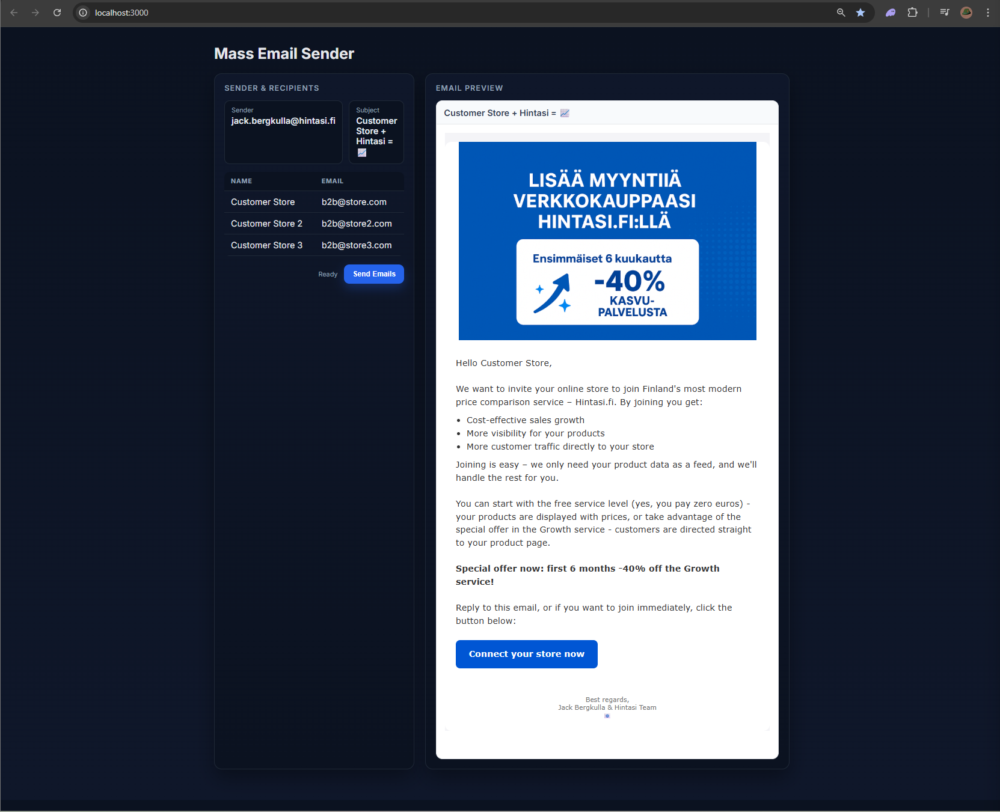

# Mass Email Sender

A simple Express.js application for previewing and mass-sending personalized HTML emails via SMTP. Features a clean web interface for email preview and batch sending capabilities.

## Features

- 📧 **Email Preview**: Preview your email template with personalized content
- 👥 **Mass Sending**: Send emails to multiple recipients with personalization
- 🎨 **HTML Templates**: Support for rich HTML email templates
- 🔧 **Configurable**: Easy configuration through environment variables
- 🛡️ **Secure**: Sensitive data stored in environment variables

## Quick Start

### 1. Clone and Install

```bash
git clone <your-repo-url>
cd mass-send-mails-script
npm install
```

### 2. Environment Setup

Copy the example environment file and configure your settings:

```bash
cp env.example .env.local
```

Edit `.env.local` with your actual values:

```env
# SMTP Configuration
ZOHO_SMTP_PASSWORD=your_actual_password
ZOHO_SMTP_USER=your_email@yourdomain.com
ZOHO_SMTP_HOST=smtppro.zoho.eu
ZOHO_SMTP_PORT=587

# Sender Configuration
SENDER_EMAIL=your_sender_email@yourdomain.com
SENDER_NAME=Your Company Name

# Server Configuration
PORT=3000

# Email Configuration Selection
EMAIL_CONFIG_NAME=example-email
```

### 3. Create Your Email Template

Copy the example email configuration:

```bash
cp email-configs/example-email.js email-configs/my-email.js
```

Edit `email-configs/my-email.js` with your content and recipients, then update `EMAIL_CONFIG_NAME` in `.env.local` to `my-email`.

### 4. Run the Application

```bash
npm start
```

Open `http://localhost:3000` in your browser.

## Screenshot



## Configuration

### Email Templates

Email templates are stored in the `email-configs/` directory. Each template exports an `EMAIL_CONFIG` object with:

- `subject`: Email subject line (use `{{RECIPIENT_NAME}}` for personalization)
- `recipients`: Array of `{ name, email }` objects
- `html`: HTML email content (use `{{RECIPIENT_NAME}}` for personalization)

### Environment Variables

| Variable | Description | Default |
|----------|-------------|---------|
| `ZOHO_SMTP_PASSWORD` | SMTP password | Required |
| `ZOHO_SMTP_USER` | SMTP username | `your-email@yourdomain.com` |
| `ZOHO_SMTP_HOST` | SMTP host | `smtppro.zoho.eu` |
| `ZOHO_SMTP_PORT` | SMTP port | `587` |
| `SENDER_EMAIL` | From email address | `your-email@yourdomain.com` |
| `SENDER_NAME` | From name | `Your Company` |
| `PORT` | Server port | `3000` |
| `EMAIL_CONFIG_NAME` | Email template to use | `example-email` |

## Usage

1. **Preview**: Visit the homepage to see a preview of your email template
2. **Send**: Use the "Send Emails" button to mass-send to all recipients
3. **Monitor**: Check the response for delivery status and message IDs

## Security

- All sensitive data (passwords, email addresses) is stored in `.env.local`
- Email configurations are excluded from version control
- Use app-specific passwords for SMTP authentication

## SMTP Providers

This application is configured for Zoho SMTP but can be adapted for other providers:

- **Gmail**: Use `smtp.gmail.com:587` with app password
- **Outlook**: Use `smtp-mail.outlook.com:587`
- **Custom SMTP**: Update host/port in environment variables

## Development

This application was developed with the assistance of AI tools to create a clean, secure, and well-documented email sending solution.

## License

MIT License - feel free to use this project for your own email campaigns.

## Contributing

1. Fork the repository
2. Create your feature branch
3. Commit your changes
4. Push to the branch
5. Create a Pull Request
